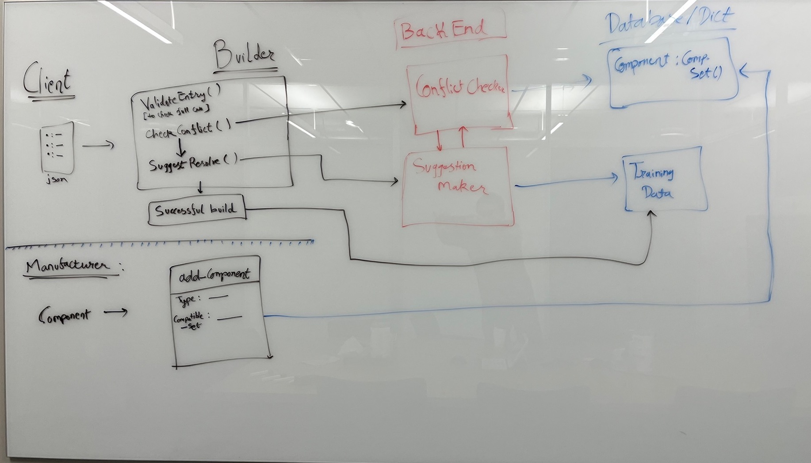

# CarMaker

### [Note: This is a basic documentation and work in progress, but I have extensively documented the files. Please refer to them when needed]

A tool to allow creating custom cars

It has two interfaces: 

### Client
  The tool helps a client create custom cars and resolve dependency issues in their design

### Manufacturer 
  A manufacturer can add their custom tool and compatibility to the database of tools
  
  
 ## Instructions
 
 You only need to alter the Simulation.py and main.py. In Simulation.py, as a client, 
 you can add components to your design and send it to build. 
 As a manufacturer, you can create new components and add them to the database along with their compatibility.
 
 ### Basic design

In the implementation, I have integrated the backend in the diagram into my Builder class. But for complex dependency checks, 
it should be wise to implement it separately for security and manageability reasons.